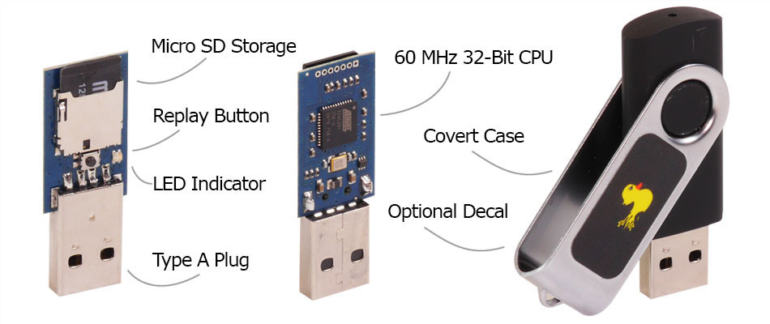

##Purchase
The USB Rubber Ducky is currently in stock and shipping world-wide today from [The HakShop](http://hakshop.myshopify.com/products/usb-rubber-ducky).
Bulk discounts available for accredited educational institutions, government, military and non-profit hackerspaces. [Request a Quote](http://hakshop.myshopify.com/pages/contact)

  <h2 class="featurette-heading">USB Rubber Ducky The Original Keystroke Injection Tool</h2>
  
Since 2010 the USB Rubber Ducky has been a favorite amongst hackers, penetration testers and IT professionals. With origins as a humble IT automation proof-of-concept using an embedded dev-board, it has grown into a full fledged commercial Keystroke Injection Attack Platform. The USB Rubber Ducky captured the imagination of hackers with its simple scripting language, formidable hardware, and covert design.
  

---

  <iframe width="853" height="480" src="https://www.youtube.com/embed/sbKN8FhGnqg" frameborder="0" allowfullscreen></iframe>

---

  
  <h2 class="featurette-heading">Quack like a Keyboard!</h2>
  
Nearly every computer including desktops, laptops, tablets and smartphones take input from Humans via Keyboards. It's why there's a specification with the ubiquitous USB standard known as HID - or Human Interface Device. Simply put, any USB device claiming to be a Keyboard HID will be automatically detected and accepted by most modern operating systems. Whether it be a Windows, Mac, Linux or Android device the <i>Keyboard is King</i>. 

    By taking advantage of this inherent trust with scripted keystrokes at speeds beyond 1000 words per minute traditional countermeasures can be bypassed by this tireless trooper - the USB Rubber Ducky.
  

---

  
  <h2 class="featurette-heading">Ducky Script. Simply Simple.</h2>
  

    USB Rubber Ducky's scripting language makes writing payloads simple. No programming experience needed.
  
<ul><li>Typing "<i>Hello World</i>" is as simple as programming <i>STRING Hello World</i></li>
  <li>Add pauses in between commands with <i>DELAY</i>. Try <i>DELAY 100</i> for short 100 milliseconds pauses or <i>DELAY 1000</i> for longer 1 second pauses.</li>
  <li>Combine specials keys. <i>ALT F4, CONTROL ESCAPE, WINDOWS R, SHIFT TAB</i>. They all do exactly as you might expect.</li>
  <li>Comment your code! Use <i>REM</i> just as you would in any other language.</li>
  <li>That's it! You just learned Ducky Script.</li></ul>
  

---

  
  <h2 class="featurette-heading">Cross Platform.</h2>
  

    Windows, Mac, Linux, Android - they all love keyboards. Convenience is king, so when it comes to plugging in a new input device the default is to accept and obey. 
      Keyboards represent <b>human input</b> afterall. 
      Before USB there were various standards, be it PS/2, AT, Apple Desktop Bus and various other DINs. Now that everything is Universal the Human Input Device is "Plug and Play".        
        
  

  ---

  
  <h2 class="featurette-heading">Community Firmware, Encoders and Toolkits</h2>
  

  

The USB Rubber Ducky project has fostered considerable innovation and creativity among the community. Some gems include

  <ul>
    <li>Customize pre-assembled attacks from our repository - <a href="https://github.com/hak5darren/USB-Rubber-Ducky/wiki/Payloads">Payload Wiki</a></li>
    <li>Online <a href="http://ducktoolkit-411.rhcloud.com/Home.jsp">Duck Toolkit</a>&nbsp;for simple Reconnaissance, Exploitation and Reportin</li>
    <li>The <a href="https://code.google.com/p/simple-ducky-payload-generator/">Simple Ducky Payload Generator</a> with Password Cracker and Meterpreter and Netcat integration</li>
    <li>The <a href="https://forums.hak5.org/index.php?/topic/29804-infoexecutablevid-pid-swapperexe-easily-swap-random-vidpid-numbers/">VID &amp; PID Swapper</a> to cloak your device</li>
    <li><a href="https://code.google.com/p/ducky-decode/">Ducky-Decode</a> Firmware and Encoder adding Mass Storage, Multiple Payloads, Multilingual and more.</li>
    <li>And of course the <a href="https://forums.hak5.org/index.php?/forum/56-usb-rubber-ducky/">USB Rubber Ducky Forums</a> for Payload sharing, suggestions, questions and information.</li>
  </ul>

